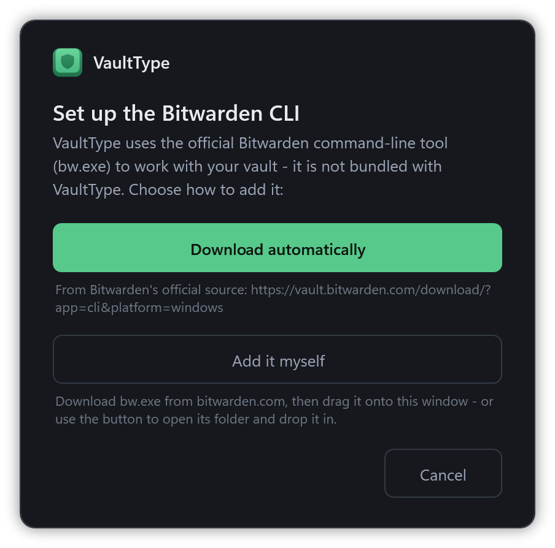
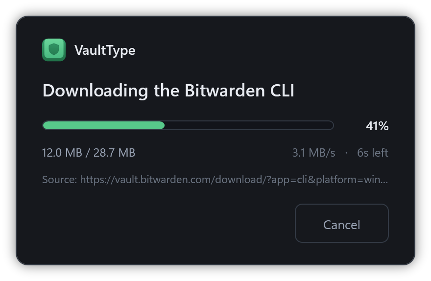

<div align="center">


# VaultType

**Secure, KeePass-style auto-type for Bitwarden & Vaultwarden - on Windows.**

[](#requirements)
[](#requirements)
[](https://github.com/friedPotat0/VaultType/actions/workflows/ci.yml)
[](https://github.com/friedPotat0/VaultType/releases/latest)
[](LICENSE)
[](https://ko-fi.com/friedpotat0)

<br />


</div>

VaultType gives Bitwarden a global auto-type hotkey - the feature power users miss from KeePass.
Press a shortcut and it types your username, password and TOTP into **any** window: desktop
applications *and* browsers. It uses the official Bitwarden CLI as its vault backend, so every
cryptographic operation is performed by Bitwarden's own code. VaultType is a hardened front-end
that is built to **never** persist your secrets.

> [!IMPORTANT]
> VaultType is an independent, unofficial project. It is **not affiliated with, endorsed by, or
> sponsored by Bitwarden Inc.** "Bitwarden" and "Vaultwarden" are trademarks of their respective
> owners. VaultType only drives the official Bitwarden CLI, which connects to whichever server you
> configure - your self-hosted Vaultwarden or bitwarden.com.

---

## Table of contents

- [Features](#features)
- [Screenshots](#screenshots)
- [Security model](#security-model)
- [Requirements](#requirements)
- [Installation](#installation)
- [Configuration](#configuration)
- [Usage](#usage)
- [Auto-type sequences](#auto-type-sequences)
- [Languages](#languages)
- [Building from source](#building-from-source)
- [Contributing](#contributing)
- [Support](#support)
- [License](#license)

## Features

- **Global hotkey** (default `Ctrl+Alt+A`) opens a context-aware entry picker.
- **KeePass-style picker** - entries matching the active window/URL come first, but you can
  **search the whole vault** if the automatic match is wrong.
- **Auto-type** the full sequence (username → Tab → password → Enter), or username / password /
  TOTP only.
- **Copy to clipboard** (right-click) for username / password / TOTP, with the clipboard
  **cleared automatically** after a timeout.
- **Learn associations** - pick a non-suggested entry and VaultType offers to remember the
  current site or app for next time.
- **Local TOTP** generation (RFC 6238) - no clipboard, no extra network calls.
- **Real favicons** served by *your own* Vaultwarden (`/icons`), cached locally - no third-party
  icon service is contacted.
- **Auto-lock** after inactivity (default 30 minutes); it also re-locks after the computer wakes from sleep or standby, since real time keeps counting.
- **Multilingual** - ships in 11 languages, follows your Windows display language automatically.
- Clean dark interface, runs quietly in the system tray.

## Screenshots

The picker is context-aware: entries matching the active window or URL come first, and you can
search the whole vault at any time. Every window shares the same clean, dark interface.

<div align="center">
<table>
  <tr>
    <td colspan="2" align="center">
      <br />
      <sub><b>Entry picker</b> - matches for the active window come first; start typing to search the whole vault.</sub><br /><br />
    </td>
  </tr>
  <tr>
    <td align="center" valign="top" width="50%">
      <br />
      <sub><b>First run</b> - VaultType asks before anything touches the network: download the CLI, or add your own.</sub><br /><br />
    </td>
    <td align="center" valign="top" width="50%">
      <br />
      <sub><b>Download</b> - live progress with transfer size, speed and time remaining; cancel any time.</sub><br /><br />
    </td>
  </tr>
  <tr>
    <td align="center" valign="top" width="50%">
      <br />
      <sub><b>Vaultwarden sign-in</b> - pick the account type, then server URL, email and master password.</sub><br /><br />
    </td>
    <td align="center" valign="top" width="50%">
      <br />
      <sub><b>Bitwarden.com sign-in</b> - API-key login by default (avoids the CAPTCHA); no server field.</sub><br /><br />
    </td>
  </tr>
  <tr>
    <td align="center" valign="top" width="50%">
      <br />
      <sub><b>Unlock</b> - on later launches just the master password (locked memory, then discarded).</sub><br /><br />
    </td>
    <td align="center" valign="top" width="50%">
      <br />
      <sub><b>Settings</b> - hotkey, timeouts, language and the security-hardening toggles.</sub><br /><br />
    </td>
  </tr>
</table>
</div>

## Security model

VaultType is designed to make it as hard as possible to leak, intercept or scrape your master
password or vault data.

- **Master password** only ever exists as a `SecureString`, copied into **locked, non-paged
  memory** (`VirtualLock`) and handed to the CLI through a **private environment block** - never
  a command-line argument, never the parent environment, never a managed string. It is
  **discarded immediately** after unlocking and is not kept for the session.
- **Vault secrets in RAM** (passwords, TOTP seeds) are stored **AES-256-GCM encrypted** under an
  ephemeral key held in locked memory. Plaintext exists only for the milliseconds needed to type a
  field, inside a locked buffer that is then zeroed. Locking wipes the key, rendering any leftover
  ciphertext useless.
- The `list items` output is parsed **byte-by-byte**, so the full plaintext JSON never becomes a
  managed string on the heap.
- Windows are hidden from screen capture (`WDA_EXCLUDEFROMCAPTURE`), legacy DLL/hook injection is
  blocked (`ProcessExtensionPointDisablePolicy`), and the app refuses to run under a debugger.
- **Auto-type aborts instantly** if focus leaves the target window - no stray characters end up
  in the wrong place, and nothing is typed if focus cannot be restored to the target.
- **No clipboard** is used for typing. The optional copy actions are the only clipboard use, and
  they self-clear.
- The application itself opens **no network connections** except favicon requests to *your*
  Vaultwarden (which you can disable) and the manual *Check for updates* action (a version check
  against GitHub). All server communication is performed by the official CLI.

> [!NOTE]
> No user-space password manager - VaultType or KeePass - can fully defend against an attacker who
> already runs code as your Windows user (kernel keyloggers, memory scraping). These measures
> shrink the attack surface to brief, well-contained windows; they are not absolute.

## Requirements

- Windows 10 or 11 (x64)
- A Bitwarden or self-hosted Vaultwarden account

Release builds are **self-contained** - the .NET runtime is baked into the single `.exe`, so
there is nothing else to install. (To [build from source](#building-from-source) you need the
[.NET 9 SDK](https://dotnet.microsoft.com/download/dotnet/9.0) instead.)

The official **Bitwarden CLI** (`bw.exe`) is **not bundled** (it is Bitwarden's own binary). On
first run VaultType **asks** whether to download it automatically from the official source - kept
in `%LOCALAPPDATA%\VaultType` - or to add your own. The automatic download needs internet access,
so if a firewall (e.g. NetLimiter) is running, allow VaultType through it. To skip the download
entirely - for offline installs, or a firewall you'd rather not touch - place your own `bw.exe`
next to `VaultType.exe` or into `%LOCALAPPDATA%\VaultType\bw.exe` beforehand, or point to it in the
first-run prompt.

## Installation

Grab either build from the [latest release](../../releases/latest):

- **Installer** (recommended) - `VaultType-<version>-Setup.exe`. Installs VaultType into your user
  profile with a Start-menu shortcut and an uninstaller; no admin rights needed. You can delete the
  downloaded setup afterwards.
- **Portable** - `VaultType-<version>-win-x64.exe`. A single self-contained file you run directly;
  keep it somewhere permanent (not your Downloads folder, where it's easy to delete by accident).

Then, either way:

1. Run it. Windows may show a SmartScreen warning because it isn't code-signed (there is currently
   no code-signing certificate for this project) - click *More info -> Run anyway*.
2. On first launch it asks whether to download the official Bitwarden CLI or add it yourself, then
   shows the sign-in window - pick **Vaultwarden** or **Bitwarden.com** and enter your details.
3. Optional: enable *Start with Windows* from the tray menu.

> [!NOTE]
> **Signing in to bitwarden.com uses a personal API key by default.** The Bitwarden CLI can't
> solve bitwarden.com's login CAPTCHA, so an API key is the reliable way in (it also avoids the
> 2FA prompt). Create one in the Bitwarden web vault under *Account settings -> Security -> Keys
> -> View API key*, then paste the client ID and secret. **Self-hosted Vaultwarden** has no such
> CAPTCHA, so it simply uses your email and master password.

## Configuration

Settings live in `%LOCALAPPDATA%\VaultType\config.json` - **no secrets are stored there**:

| Key | Default | Description |
| --- | --- | --- |
| `ServerUrl` | - | Your Bitwarden / Vaultwarden URL |
| `Hotkey` | `Ctrl+Alt+A` | Global hotkey |
| `Language` | `auto` | UI language (`auto` follows Windows) |
| `IdleTimeoutMinutes` | `30` | Auto-lock after inactivity |
| `ClearFieldBeforeTyping` | `true` | Select the field (Ctrl+A) before typing |
| `ShowIcons` | `true` | Favicons from your own server (`false` = letter avatars, offline) |
| `ClipboardClearSeconds` | `12` | Clear the clipboard this long after a copy |
| `ExcludeFromScreenCapture` | `true` | Hide windows from screenshots |
| `AntiDebugger` | `true` | Exit if a debugger attaches |

## Usage

Press the hotkey, unlock once, then in the picker:

| Input | Action |
| --- | --- |
| `↑` `↓` | Move selection |
| `Enter` | Auto-type (username → Tab → password → Enter) |
| `Ctrl+U` / `Ctrl+P` / `Ctrl+T` | Type username / password / TOTP only |
| Right-click | Copy username / password / TOTP |
| Type | Search the whole vault |
| `Esc` | Cancel |

For desktop apps, add a URI like `app://programname.exe` to the entry - or simply let VaultType
offer to remember it the first time.

## Auto-type sequences

Pressing Enter on an entry types the default sequence:

```
{USERNAME}{TAB}{PASSWORD}{ENTER}
```

You can override this per entry: add a **custom text field** named `auto-type` to the Bitwarden
entry and set its value to your own sequence. Entries with a custom sequence show a keyboard badge
in the picker (hover it to see the exact sequence). `Ctrl+U` / `Ctrl+P` / `Ctrl+T` always type a
single field, regardless of the custom sequence.

Supported placeholders (case-insensitive):

| Placeholder | Types |
| --- | --- |
| `{USERNAME}` / `{USER}` | the username |
| `{PASSWORD}` / `{PASS}` | the password |
| `{TOTP}` | the current TOTP code |
| `{TAB}` `{ENTER}` `{SPACE}` | those keys |
| `{CLEARFIELD}` | selects the field first (Ctrl+A) |
| `{DELAY 200}` | waits 200 ms |
| any other text | typed literally |

Example for a two-step login where the username comes first and the password field only appears a
moment later (the way PayPal and some others do it):

```
{USERNAME}{ENTER}{DELAY 1500}{PASSWORD}{ENTER}
```

The field name (`auto-type`) can be changed via `AutoTypeFieldName` in `config.json`.

## Languages

VaultType is available in: **English, Deutsch, Español, Français, Italiano, 日本語, Nederlands,
Polski, Português (Brasil), Русский, 简体中文.** By default the interface follows your Windows
display language (falling back to English), or you can pick a language explicitly under
**Settings -> Language**. Changing the language restarts VaultType so the new strings take effect.

## Building from source

Needs the [.NET 9 SDK](https://dotnet.microsoft.com/download/dotnet/9.0).

```powershell
dotnet publish src/VaultType/VaultType.csproj -c Release -o dist
```

That gives you a normal framework-dependent `dist/VaultType.exe`. To reproduce the self-contained
single-file build the release workflow ships:

```powershell
dotnet publish src/VaultType/VaultType.csproj -c Release -r win-x64 --self-contained true `
  -p:PublishSingleFile=true -p:IncludeNativeLibrariesForSelfExtract=true -p:EnableCompressionInSingleFile=true
```

The Bitwarden CLI is fetched automatically on first launch.

## Contributing

Issues and pull requests are welcome. Please keep changes focused and describe the motivation.
Commit messages follow [Conventional Commits](https://www.conventionalcommits.org) (`feat:`,
`fix:`, `perf:`, ...) - the release changelog is generated from them.
Translations can be added as a single JSON file under `Localization/`.

## Support

If VaultType is useful to you, you can support development on Ko-fi:

<a href="https://ko-fi.com/friedpotat0"></a>

## License

Apache License 2.0 **with the Commons Clause** (you may use, modify and share it freely, but not
sell it). See [LICENSE](LICENSE).
