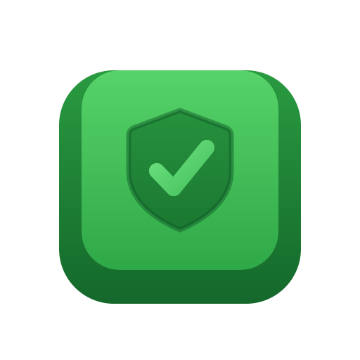
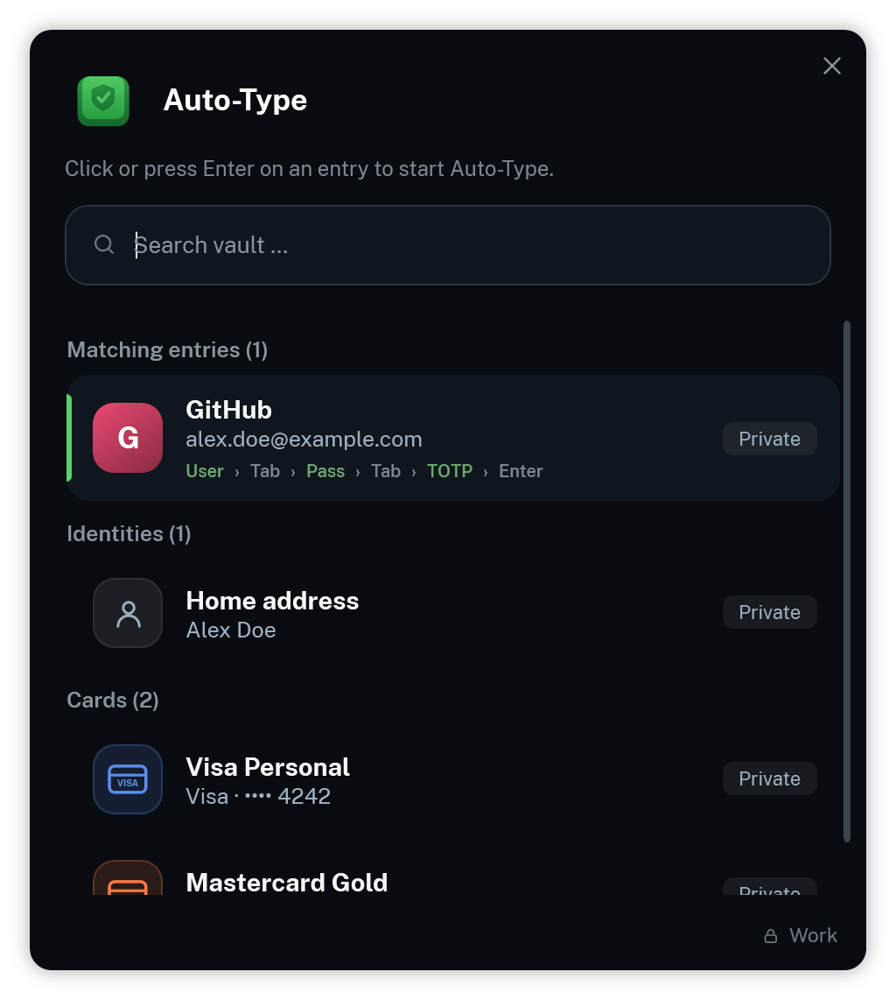
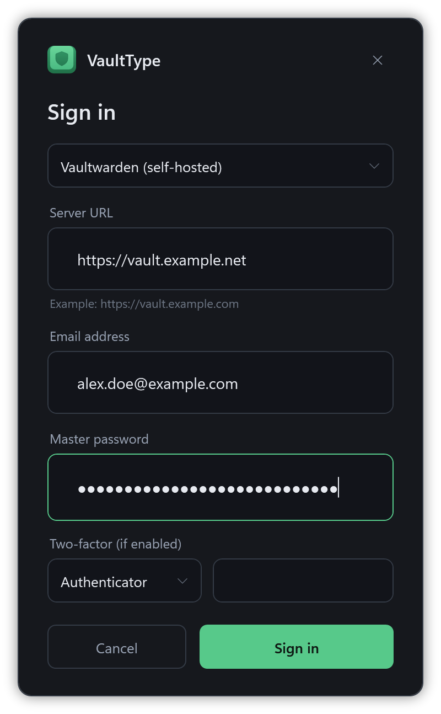
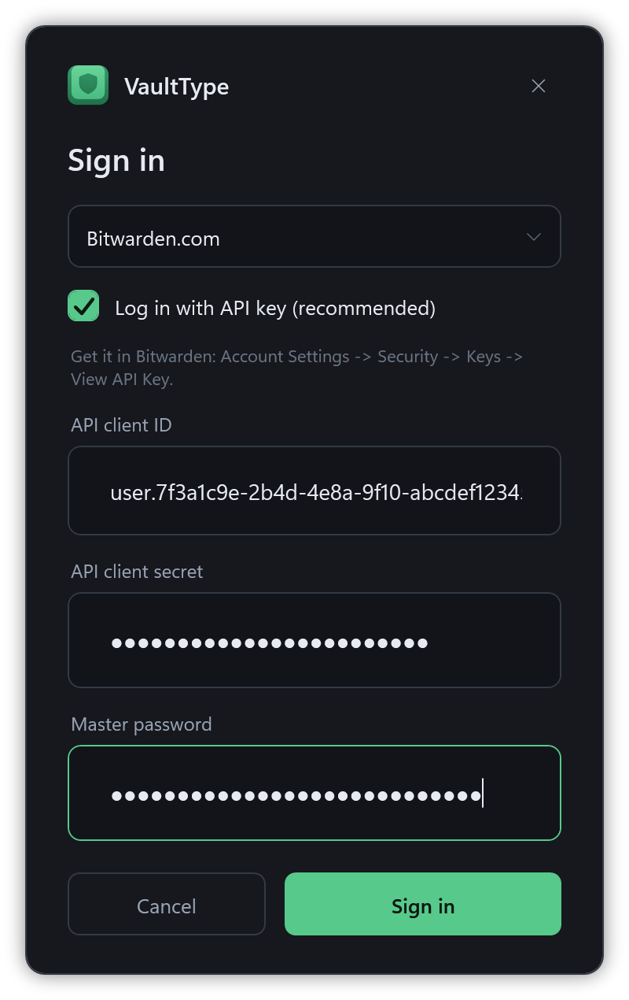
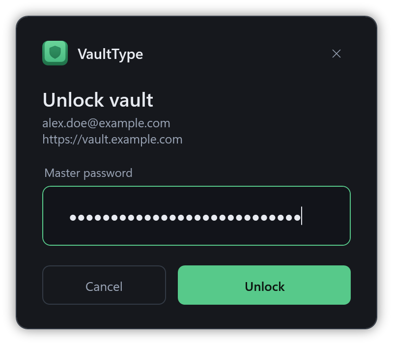
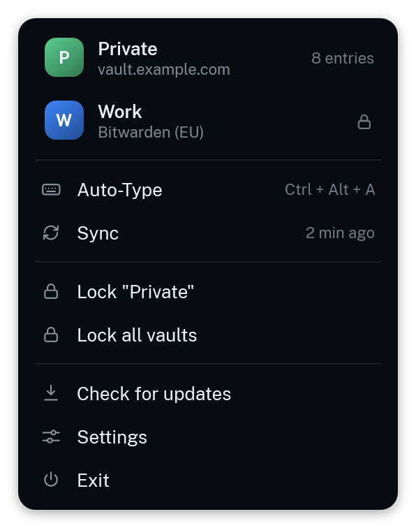
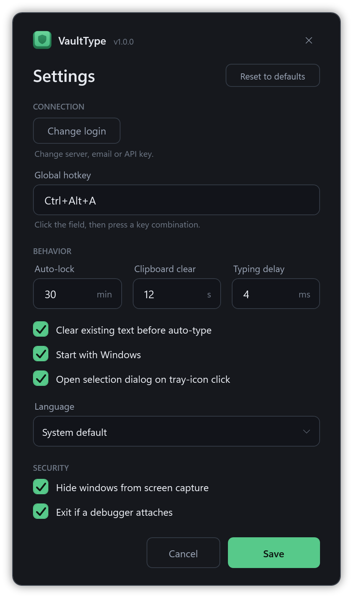
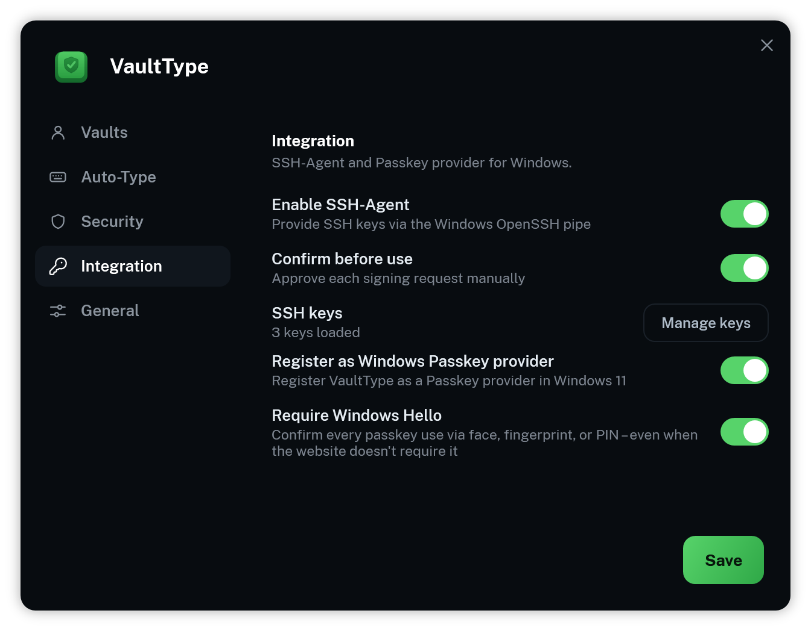
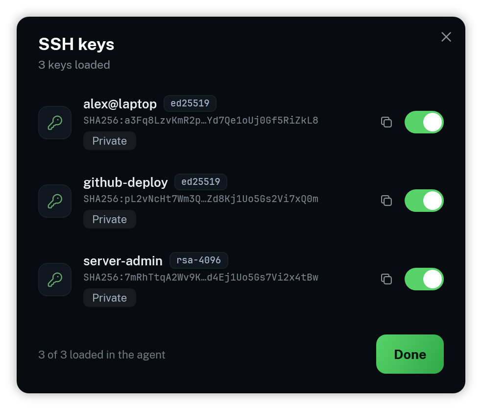

<div align="center">



# VaultType

**A native Bitwarden & Vaultwarden client for Windows - KeePass-style auto-type, SSH agent and passkeys.**

[](#requirements)
[](#requirements)
[](https://github.com/friedPotat0/VaultType/actions/workflows/ci.yml)
[](https://github.com/friedPotat0/VaultType/releases/latest)
[](https://apps.microsoft.com/detail/9N5CLMW5XJ49)
[](LICENSE)
[](https://ko-fi.com/friedpotat0)

<br />



</div>

VaultType gives Bitwarden a global auto-type hotkey - the feature power users miss from KeePass.
Press a shortcut and it types your username, password and TOTP into **any** window: desktop
applications *and* browsers. Beyond auto-type, it can serve the **SSH keys** stored in your vault
through the Windows OpenSSH agent, and act as a **Windows 11 passkey provider** (experimental).

VaultType is a **native Bitwarden client**: it speaks the Bitwarden server API directly and
performs all cryptography in-process - no Bitwarden CLI, no browser extension, no helper
processes. The entire app is a single hardened executable that is built to **never** persist your
secrets.

> [!IMPORTANT]
> VaultType is an independent, unofficial project. It is **not affiliated with, endorsed by, or
> sponsored by Bitwarden Inc.** "Bitwarden" and "Vaultwarden" are trademarks of their respective
> owners. VaultType implements the Bitwarden client protocol and connects only to the server you
> configure - your self-hosted Vaultwarden/Bitwarden or the bitwarden.com cloud.

---

## Table of contents

- [Features](#features)
- [Screenshots](#screenshots)
- [Security model](#security-model)
- [Requirements](#requirements)
- [Installation](#installation)
- [Configuration](#configuration)
- [Usage](#usage)
- [Auto-type sequences](#auto-type-sequences)
- [SSH agent](#ssh-agent)
- [Passkeys](#passkeys-experimental)
- [Languages](#languages)
- [Building from source](#building-from-source)
- [Contributing](#contributing)
- [Support](#support)
- [License](#license)

## Features

- **Global hotkey** (default `Ctrl+Alt+A`) opens a context-aware entry picker.
- **KeePass-style picker** - entries matching the active window/URL come first, but you can
  **search the whole vault** if the automatic match is wrong.
- **Auto-type** the full sequence (username → Tab → password → Enter), or username / password /
  TOTP only - with per-entry [custom sequences](#auto-type-sequences).
- **Copy to clipboard** (right-click) for username / password / TOTP, with the clipboard
  **cleared automatically** after a timeout.
- **Learn associations** - pick a non-suggested entry and VaultType offers to remember the
  current site or app for next time.
- **Multiple accounts** - keep several vaults side by side (say a personal Vaultwarden and a work
  Bitwarden cloud). Unlock as many as you like; the picker merges their entries and tags each with a
  coloured account badge. Locked accounts show up as chips you can unlock on the spot, without
  leaving the picker. Each vault keeps its own session and its own encryption key.
- **Native vault client** - VaultType talks to the Bitwarden/Vaultwarden API itself (PBKDF2 *and*
  Argon2id KDF, API-key login, two-factor via authenticator app, email, YubiKey or Duo). No
  Bitwarden CLI to download, verify or keep updated.
- **SSH agent** - serve the SSH keys stored in your vault over the standard Windows OpenSSH agent
  pipe; `ssh`/`git` just work, with an optional confirmation for every signature.
- **Passkey provider** *(experimental, packaged edition only)* - register VaultType as a Windows 11
  passkey provider and use the FIDO2 credentials in your vault for website sign-ins, gated behind
  Windows Hello.
- **PIN unlock** - unlock with a short PIN instead of the full master password, Bitwarden-style
  (wrong-PIN limit, optional "require master password after restart").
- **Local TOTP** generation (RFC 6238, plus Steam Guard) - no clipboard, no extra network calls.
- **Real favicons** served by *your own* server (`/icons`), cached locally - no third-party icon
  service is contacted.
- **Auto-lock** after inactivity (default 30 minutes); it also re-locks after the computer wakes
  from sleep or standby, since real time keeps counting.
- **Master password reprompt** - entries flagged in Bitwarden as "ask for master password" are
  re-confirmed before typing or copying.
- **Multilingual** - ships in 11 languages, follows your Windows display language automatically.
- Clean dark interface, runs quietly in the system tray.

## Screenshots

The picker is context-aware: entries matching the active window or URL come first, and you can
search the whole vault at any time. Every window shares the same clean, dark interface.

<div align="center">
<table>
  <tr>
    <td colspan="2" align="center">
      <br />
      <sub><b>Entry picker</b> - matches for the active window come first; start typing to search the whole vault. With more than one account, each entry carries a coloured badge and locked vaults appear as chips you can unlock in place.</sub><br /><br />
    </td>
  </tr>
  <tr>
    <td align="center" valign="top" width="50%">
      <br />
      <sub><b>Self-hosted sign-in</b> - server URL, email and master password, plus your second factor if the account has one.</sub><br /><br />
    </td>
    <td align="center" valign="top" width="50%">
      <br />
      <sub><b>Bitwarden cloud sign-in</b> - pick the US or EU region; API-key login by default (avoids the CAPTCHA).</sub><br /><br />
    </td>
  </tr>
  <tr>
    <td align="center" valign="top" width="50%">
      <br />
      <sub><b>Unlock</b> - on later launches just the master password or your PIN (locked memory, then discarded).</sub><br /><br />
    </td>
    <td align="center" valign="top" width="50%">
      <br />
      <sub><b>Tray menu</b> - every account with its state, auto-type, sync, lock, updates and settings one right-click away.</sub><br /><br />
    </td>
  </tr>
  <tr>
    <td align="center" valign="top" width="50%">
      <br />
      <sub><b>Settings</b> - organised into Vaults, Auto-Type, Security, Integration and General. Manage your vaults (name, colour, add or remove) alongside every behaviour and hardening toggle.</sub><br /><br />
    </td>
    <td align="center" valign="top" width="50%">
      <br />
      <sub><b>Integration</b> - switch on the SSH agent and the Windows passkey provider, with per-use confirmation and Windows Hello gating.</sub><br /><br />
    </td>
  </tr>
</table>
</div>

## Security model

VaultType is designed to make it as hard as possible to leak, intercept or scrape your master
password or vault data.

- **Everything happens in one process.** Login, sync and all vault cryptography are implemented
  natively (PBKDF2-SHA256 / Argon2id key derivation, AES-256-CBC + HMAC verification, RSA key
  unwrapping). Your master password never crosses a process boundary, a command line or an
  environment block - there is no CLI child process anymore.
- **Master password** (and PIN) only ever exist as a `SecureString`, marshalled into **locked,
  non-paged memory** (`VirtualLock`) for the moment of key derivation, then zeroed. They are
  **discarded immediately** after unlocking and are not kept for the session.
- **Vault secrets in RAM** (passwords, TOTP seeds, SSH and passkey private keys) are stored
  **AES-256-GCM encrypted** under an ephemeral key held in locked memory. Plaintext exists only for
  the milliseconds needed to type or sign, inside a locked buffer that is then zeroed. Locking
  wipes the key, rendering any leftover ciphertext useless.
- **Nothing decrypted touches the disk.** Per account, only the key envelopes needed to unlock
  (master-key-wrapped user key, DPAPI-sealed refresh token, optional PIN envelope) plus non-secret
  metadata are stored under `%LOCALAPPDATA%\VaultType` - a folder whose ACL is restricted to your
  user. Vault items themselves are re-fetched from the server on every unlock.
- Windows are hidden from screen capture (`WDA_EXCLUDEFROMCAPTURE`), legacy DLL/hook injection is
  blocked (`ProcessExtensionPointDisablePolicy`), and the app refuses to run under a debugger.
- **Auto-type aborts instantly** if focus leaves the target window - no stray characters end up
  in the wrong place, and nothing is typed if focus cannot be restored to the target.
- **No clipboard** is used for typing. The optional copy actions are the only clipboard use, and
  they self-clear (only if the clipboard still holds what VaultType put there).
- **PIN unlock is rate-limited**: five wrong PINs destroy the PIN envelope and force the master
  password. With *require master password after restart* (the default) the envelope only ever
  lives in RAM.
- **Minimal supply chain**: a single Microsoft-published NuGet package (`System.Formats.Cbor`).
  Argon2id and Ed25519 are implemented in VaultType itself instead of pulling third-party DLLs -
  which also means the app runs on WDAC-locked machines that only allow Microsoft-signed binaries.
- The application opens **no network connections** except to *your* configured vault server
  (API + favicons, the latter can be disabled) and the *Check for updates* action (a version
  check against GitHub).

> [!NOTE]
> No user-space password manager - VaultType or KeePass - can fully defend against an attacker who
> already runs code as your Windows user (kernel keyloggers, memory scraping). These measures
> shrink the attack surface to brief, well-contained windows; they are not absolute.

## Requirements

- Windows 10 or 11 (x64) - the passkey provider additionally needs Windows 11 24H2
- A Bitwarden or self-hosted Vaultwarden account

That's it. Release builds are **self-contained** - the .NET runtime is baked into the single
`.exe`, and the Bitwarden client is built in, so there is nothing else to install or download.
(To [build from source](#building-from-source) you need the
[.NET 10 SDK](https://dotnet.microsoft.com/download/dotnet/10.0) instead.)

## Installation

Pick one of three ways to install:

- **Microsoft Store** (recommended) - [get VaultType from the Store](https://apps.microsoft.com/detail/9N5CLMW5XJ49).
  Store-signed (no SmartScreen warning), updates automatically, and it is the **packaged edition** -
  the only one that can act as a [Windows passkey provider](#passkeys-experimental).
- **Installer** - `VaultType-<version>-Setup.exe` from the [latest release](../../releases/latest).
  Installs VaultType into your user profile with a Start-menu shortcut and an uninstaller; no admin
  rights needed. You can delete the downloaded setup afterwards.
- **Portable** - `VaultType-<version>-win-x64.exe` from the [latest release](../../releases/latest).
  A single self-contained file you run directly; keep it somewhere permanent (not your Downloads
  folder, where it's easy to delete by accident).

Then, either way:

1. Run it. For the GitHub builds, Windows may show a SmartScreen warning because they aren't
   code-signed (there is currently no code-signing certificate for this project) - click
   *More info -> Run anyway*. The Store build is signed by the Store and starts without a warning.
2. Sign in: pick **Bitwarden.com (US)**, **Bitwarden.eu (EU)**, **Bitwarden (self-hosted)** or
   **Vaultwarden (self-hosted)** and enter your details. If your account has two-factor
   authentication, choose the method (authenticator app, email, YubiKey, Duo) and enter the code.
   You can also pick how to unlock in the future: master password or a PIN.
3. Optional: add more accounts any time via *Add account* in the tray menu or in Settings, and
   enable the [SSH agent](#ssh-agent) or [passkey provider](#passkeys-experimental) under
   *Settings -> Integration*.

> [!NOTE]
> **The Bitwarden cloud comes in two regions** - US (`bitwarden.com`) and EU (`bitwarden.eu`);
> pick the one your account was created in, they are separate. **Signing in there uses a personal
> API key by default:** the cloud login is protected by a CAPTCHA that a desktop app cannot solve,
> so an API key is the reliable way in (it also avoids the 2FA prompt). Create one in the Bitwarden
> web vault under *Account settings -> Security -> Keys -> View API key*, then paste the client ID
> and secret - the master password is still required, it protects your keys. **Self-hosted
> Vaultwarden** has no such CAPTCHA, so it simply uses your email and master password.

## Configuration

Everything below is adjustable in the Settings window; the file itself lives in
`%LOCALAPPDATA%\VaultType\config.json` - **no secrets are stored there**:

| Key | Default | Description |
| --- | --- | --- |
| `Accounts` | `[]` | Your configured vaults (name, badge colour, server, email, unlock method) - managed in Settings, no secrets. Each account's session envelope lives in its own `accounts\<id>\` folder |
| `Hotkey` | `Ctrl+Alt+A` | Global hotkey |
| `Language` | `auto` | UI language (`auto` follows Windows) |
| `IdleTimeoutMinutes` | `30` | Auto-lock after inactivity (`0` = never) |
| `TypingDelayMs` | `4` | Delay between simulated keystrokes |
| `ClearFieldBeforeTyping` | `true` | Select the field (Ctrl+A) before typing |
| `AutoTypeFieldName` | `auto-type` | Name of the custom field holding a per-entry [sequence](#auto-type-sequences) |
| `DefaultUriMatch` | `0` | Fallback URL match for entries with no rule of their own (`0` = base domain, `1` = host, `2` = exact URL) |
| `ShowIcons` | `true` | Favicons from your own server (`false` = letter avatars, offline) |
| `ClipboardClearSeconds` | `12` | Clear the clipboard this long after a copy (`0` = never) |
| `HonorMasterPasswordReprompt` | `true` | Re-confirm entries flagged "ask for master password" in Bitwarden |
| `ExcludeFromScreenCapture` | `true` | Hide windows from screenshots |
| `AntiDebugger` | `true` | Exit if a debugger attaches |
| `SshAgentEnabled` | `false` | Serve vault SSH keys on the OpenSSH agent pipe |
| `SshConfirmEachUse` | `true` | Ask before every SSH signature |
| `SshDisabledKeys` | `[]` | SSH keys switched off in the agent (managed in the key list) |
| `PasskeyProviderEnabled` | `false` | Register as a Windows 11 passkey provider (experimental) |
| `PasskeyRequireHello` | `true` | Gate passkey use behind Windows Hello |
| `TrayClickAction` | `2` | Tray left-click: `0` = menu, `1` = auto-type, `2` = settings |
| `Autostart` | `true` | Start with Windows (per-user) |

## Usage

Press the hotkey, unlock once, then in the picker:

| Input | Action |
| --- | --- |
| `↑` `↓` | Move selection |
| `Enter` | Auto-type (username → Tab → password → Enter) |
| `Ctrl+U` / `Ctrl+P` / `Ctrl+T` | Type username / password / TOTP only |
| Right-click | Copy username / password / TOTP |
| Type | Search the whole vault |
| `Esc` | Cancel |

For desktop apps, add a URI like `app://programname.exe` to the entry - or simply let VaultType
offer to remember it the first time.

With **several accounts**, the picker lists the entries of every unlocked vault together, each
tagged with its account badge. Any vault that is still locked appears as a chip at the bottom -
click it (or press `Enter` on an empty search) to unlock just that account and fold its entries in,
without closing the picker.

The **tray menu** shows each account with its state (entry count, or a lock you can click to
unlock), and offers *Auto-type*, *Sync*, *Lock* per account or *Lock all*, *Check for updates*,
*Settings* and *Exit*.

## Auto-type sequences

Pressing Enter on an entry types the default sequence:

```
{USERNAME}{TAB}{PASSWORD}{ENTER}
```

You can override this per entry: add a **custom text field** named `auto-type` to the Bitwarden
entry and set its value to your own sequence. Entries with a custom sequence show a keyboard badge
in the picker (hover it to see the exact sequence). `Ctrl+U` / `Ctrl+P` / `Ctrl+T` always type a
single field, regardless of the custom sequence.

Supported placeholders (case-insensitive):

| Placeholder | Types |
| --- | --- |
| `{USERNAME}` / `{USER}` / `{LOGIN}` | the username |
| `{PASSWORD}` / `{PASS}` | the password |
| `{TOTP}` / `{OTP}` | the current TOTP code |
| `{TAB}` `{ENTER}` `{SPACE}` | those keys |
| `{CLEARFIELD}` | selects the field first (Ctrl+A) |
| `{DELAY 200}` | waits 200 ms (also `{WAIT}` / `{SLEEP}`) |
| any other text | typed literally |

Example for a two-step login where the username comes first and the password field only appears a
moment later (the way PayPal and some others do it):

```
{USERNAME}{ENTER}{DELAY 1500}{PASSWORD}{ENTER}
```

The field name (`auto-type`) can be changed via `AutoTypeFieldName` in `config.json`.

## SSH agent

Bitwarden vaults can store **SSH keys** as their own item type. Enable the agent under
*Settings -> Integration -> SSH agent* and VaultType serves those keys on the standard Windows
OpenSSH agent pipe (`\\.\pipe\openssh-ssh-agent`) - `ssh`, `git` and every other OpenSSH-aware
tool pick them up automatically, no key files on disk.

<div align="center">
<br />
<sub><b>Manage keys</b> - every SSH key across your vaults, with fingerprint, copy-public-key button and a per-key agent toggle.</sub>
</div>
<br />

- **Ed25519** and **RSA** keys are supported (rsa-sha2-256/512 signatures).
- *Confirm each use* (on by default) pops a dialog before every signature, naming the requesting
  key - nothing signs silently.
- **Locked vaults still advertise their keys**: a signature request for a key in a locked vault
  brings up the unlock window first, then signs. You don't have to pre-unlock before pushing.
- *Manage keys* opens a list of every SSH key across your vaults, with its fingerprint, a
  copy-public-key button, and a per-key toggle to keep individual keys out of the agent.

> [!NOTE]
> The built-in Windows *OpenSSH Authentication Agent* service uses the same pipe. If it is
> running, VaultType cannot bind and will tell you - stop it once with
> `Stop-Service ssh-agent` (and set it to *Disabled* so it stays off).

## Passkeys (experimental)

VaultType can register as a **Windows 11 passkey provider**: passkeys stored in your vault then
show up in the native Windows passkey dialog, and websites can create new passkeys directly into
your vault. Use is gated behind **Windows Hello** by default (or an explicit confirmation dialog
without it), and passkeys in locked vaults trigger the unlock window first - just like the SSH
agent.

> [!IMPORTANT]
> **Passkeys only work in the packaged edition -
> [install VaultType from the Microsoft Store](https://apps.microsoft.com/detail/9N5CLMW5XJ49).**
> Windows activates passkey providers exclusively for apps with a package identity (MSIX), which
> the installer and portable builds from GitHub do not have - in those builds the toggle under
> *Settings -> Integration* is greyed out with a note saying exactly that. Alternatively you can
> build the MSIX package yourself (`packaging/msix/build-msix.ps1`). Windows 11 24H2 or later is
> required either way.

## Languages

VaultType is available in: **English, Deutsch, Español, Français, Italiano, 日本語, Nederlands,
Polski, Português (Brasil), Русский, 简体中文.** By default the interface follows your Windows
display language (falling back to English), or you can pick a language explicitly under
**Settings -> General -> Language**. Changing the language restarts VaultType so the new strings
take effect.

## Building from source

Needs the [.NET 10 SDK](https://dotnet.microsoft.com/download/dotnet/10.0).

```powershell
dotnet publish src/VaultType/VaultType.csproj -c Release -o dist
```

That gives you a normal framework-dependent `dist/VaultType.exe`. To reproduce the self-contained
single-file build the release workflow ships:

```powershell
dotnet publish src/VaultType/VaultType.csproj -c Release -r win-x64 --self-contained true `
  -p:PublishSingleFile=true -p:IncludeNativeLibrariesForSelfExtract=true -p:EnableCompressionInSingleFile=true
```

To try the [passkey provider](#passkeys-experimental), build and install the dev-signed MSIX
package with `packaging/msix/build-msix.ps1` (needs the Windows SDK).

## Contributing

Issues and pull requests are welcome. Please keep changes focused and describe the motivation.
Commit messages follow [Conventional Commits](https://www.conventionalcommits.org) (`feat:`,
`fix:`, `perf:`, ...) - the release changelog is generated from them.
Translations can be added as a single JSON file under `Localization/`.

## Support

If VaultType is useful to you, you can support development on Ko-fi:

<a href="https://ko-fi.com/friedpotat0"></a>

## License

Apache License 2.0 **with the Commons Clause** (you may use, modify and share it freely, but not
sell it). See [LICENSE](LICENSE).

Bundled third-party components (fonts, one Microsoft NuGet package) are listed with their
licenses in [THIRD-PARTY-NOTICES.md](THIRD-PARTY-NOTICES.md). VaultType collects no data -
see the [privacy policy](PRIVACY.md).
